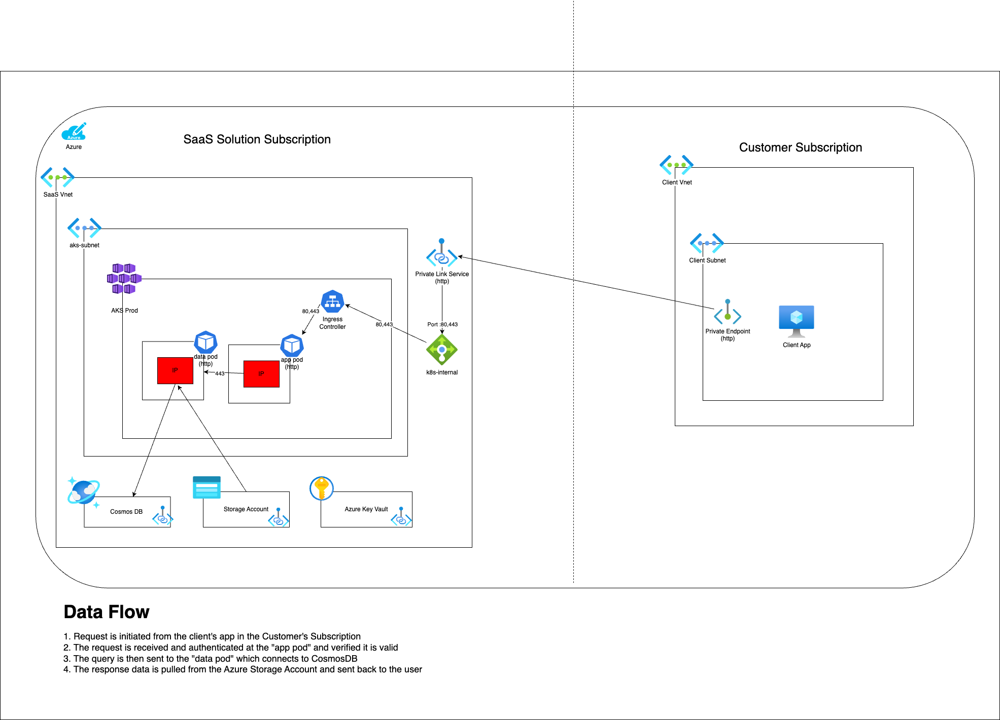

# Intent

Many ISV's are interested in achieving [Azure IP co-sell eligible status](https://learn.microsoft.com/en-us/partner-center/referrals/co-sell-requirements#requirements-for-azure-ip-co-sell-eligible-status).  One of the [requirements](https://learn.microsoft.com/en-us/partner-center/referrals/co-sell-requirements#requirements-for-azure-ip-co-sell-eligible-status) is to provide a [reference architecture diagram](https://learn.microsoft.com/en-us/partner-center/referrals/reference-architecture-diagram).

This page is designed to provide an example reference architecture diagram using [Draw.io](https://draw.io/) for Azure IP co-sell eligible status.  You can take this diagram and use it as a starting point to describe your architecture before submitting.

# Example Architecture

This architecture is an example SaaS architecture where a customer (also in Azure) uses Private Endpoint to connect to the ISV's API.

This boxes in red are the ISV's Intellectual Property (IP) and are used to signify where it runs.

Inside the ISV's subscription are the following:
* Azure Subscription
* AKS
    * Ingress Controller
    * App pod (IP)
    * Data pod (IP)
* Azure Load Balancer
* CosmosDB
* Storage Account
* Azure Key Vault

You can use this reference architecture by [downloading the Draw.io](sample-reference-architecture.drawio) file and modifying it to reflect your architecture.

