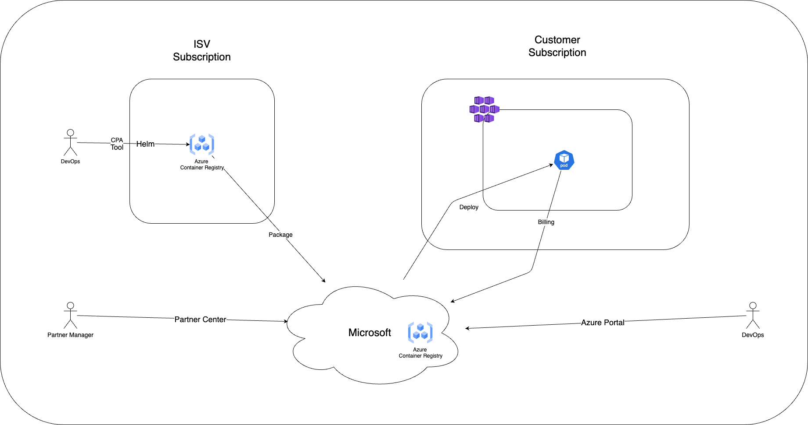

# Container Offer Architecture

> Architecture diagram for container-based Azure Marketplace offers.

## Architecture Diagram

Open [arch.drawio](arch.drawio) in [Draw.io](https://app.diagrams.net/) to view and edit.

## When to Use This

- You're packaging a Kubernetes-based application as an Azure Marketplace offer
- You need to understand the architecture of a container-based offer
