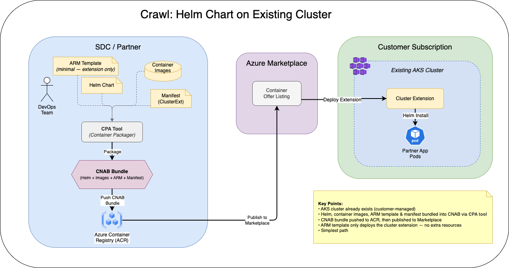
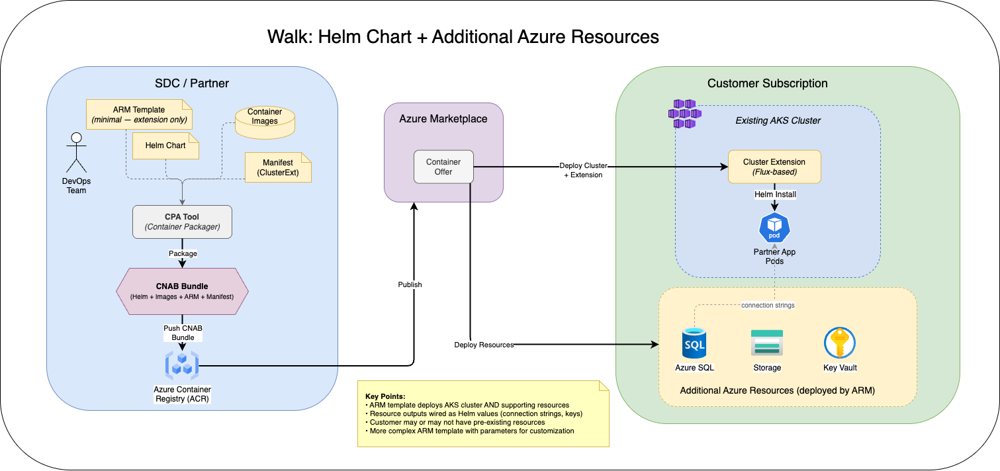
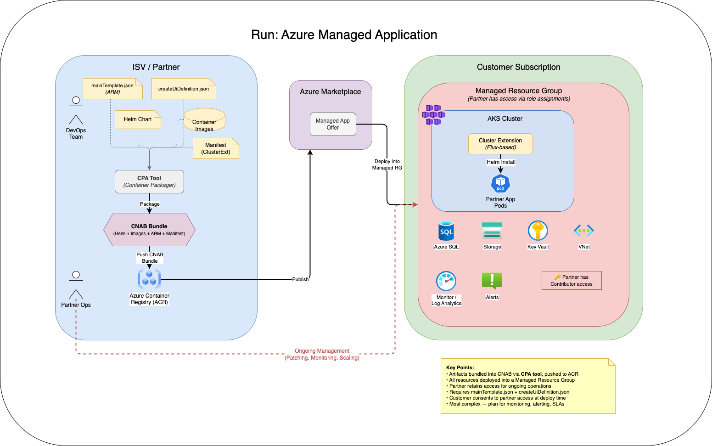

# Container Offer Architecture

> Architecture guide for container-based Azure Marketplace offers.

## Overview

A **Container Offer** on the Azure Marketplace lets partners package and sell Kubernetes-based applications to customers. The complexity of your offer depends on how much infrastructure you need to deploy and who manages it.

This guide walks through a **Crawl → Walk → Run** approach so you can pick the simplest path that meets your requirements.

---

## Crawl → Walk → Run

### Crawl: Helm Chart on an Existing Cluster (Simplest)

**When to use:** Your application can be fully deployed via a Helm chart to a customer's *existing* AKS cluster. You don't need to provision any additional Azure resources.

**What this means:**

- The customer already has an AKS cluster running
- Your entire application is packaged as a Helm chart (containers, services, config)
- Your ARM template is minimal — it essentially invokes the Helm chart deployment via the Kubernetes extension
- No extra Azure resources (databases, storage accounts, etc.) are needed

**Actions:**

1. Package your application as a Helm chart
2. Push container images to ACR (Azure Container Registry)
3. Create a minimal ARM template that deploys the Helm chart via the `Microsoft.KubernetesConfiguration/extensions` resource type
4. Create the offer in Partner Center and upload artifacts

**This is the easiest path.** If you can make this work, start here.

---

### Walk: Helm Chart + Additional Azure Resources

**When to use:** Your application needs the Helm chart deployment AND additional Azure resources (e.g., Azure SQL, Cosmos DB, Storage Account, or even the AKS cluster itself).

**What this means:**

- Everything from the Crawl stage, plus...
- You need a more substantial ARM template that deploys supporting Azure resources
- The ARM template creates the resources, then deploys the Helm chart to the cluster
- The customer may or may not already have the AKS cluster (your template can create one)

**Actions:**

1. Complete all steps from the Crawl stage
2. Create an ARM template that provisions required Azure resources (networking, databases, AKS cluster, etc.)
3. Wire up resource outputs (connection strings, endpoints) as Helm chart values
4. Test end-to-end deployment in a clean subscription

**Key considerations:**

- Keep the ARM template modular — separate infrastructure from the app deployment
- Use ARM template parameters so customers can customize resource sizing/naming
- Consider what happens if the customer already has some resources (e.g., an existing VNet)

---

### Run: Azure Managed Application (Most Complex)

**When to use:** The partner needs ongoing access to manage the infrastructure, data plane, or cluster on behalf of the customer.

**What this means:**

- Everything from the Walk stage, plus...
- The application is deployed as an [Azure Managed Application](https://learn.microsoft.com/en-us/azure/azure-resource-manager/managed-applications/overview)
- Resources are deployed into a **managed resource group** that the partner has access to
- The partner can perform ongoing operations: patching, monitoring, scaling, data management

**Actions:**

1. Complete all steps from the Walk stage
2. Create a `mainTemplate.json` (ARM) and `createUiDefinition.json` (portal wizard)
3. Define the publisher's access level via role assignments in the managed app definition
4. Package as a Managed Application offer in Partner Center
5. Build operational runbooks for managing the customer's deployment

**Key considerations:**

- **Access model:** Determine what level of access you need (Contributor, Reader, custom role)
- **Customer trust:** Customers must consent to the partner having access to their managed resource group
- **Billing complexity:** Managed apps can use different billing models (flat rate, metered, BYOL)
- **Operational burden:** You are now responsible for the health of the deployment — plan for monitoring, alerting, and incident response

---

## Decision Guide

| Question | Crawl | Walk | Run |
|----------|-------|------|-----|
| App deploys entirely via Helm? | ✅ | ✅ | ✅ |
| Needs additional Azure resources? | ❌ | ✅ | ✅ |
| Partner manages infra/data post-deploy? | ❌ | ❌ | ✅ |
| Customer must have existing AKS cluster? | ✅ | Maybe | ❌ |
| ARM template complexity | Minimal | Moderate | High |
| Time to implement | Days | Weeks | Weeks+ |

---

## Other Considerations

- **CNAB Bundles:** Container offers use CNAB (Cloud Native Application Bundle) under the hood. The Marketplace + CPA tool handles most of this for you, but understanding the bundle structure helps with debugging.
- **Cluster Extensions:** The deployment mechanism uses [AKS Cluster Extensions](https://learn.microsoft.com/en-us/azure/aks/cluster-extensions), which are based on Flux. Your Helm chart is deployed as an extension instance.
- **Update strategy:** Plan how you'll ship updates to deployed customers. Cluster extensions support auto-upgrade channels.

---

## References

- **Samples repo:** [Azure-Samples/kubernetes-offer-samples](https://github.com/Azure-Samples/kubernetes-offer-samples/tree/main/samples) — ARM templates, Helm charts, and CNAB examples for each scenario
- **MS Learn docs:** [Marketplace Container Offers](https://learn.microsoft.com/en-us/partner-center/marketplace-offers/marketplace-containers) — Official documentation for creating and publishing container offers
- **Mastering the Marketplace (Container):** [microsoft.github.io/Mastering-the-Marketplace/container](https://microsoft.github.io/Mastering-the-Marketplace/container/) — Video walkthroughs and hands-on labs
