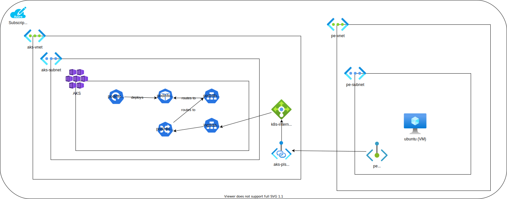

# AKS + Private Link Service

This walkthrough shows how to setup a Private Link Service with an AKS cluster and create a Private Endpoint in a separate Vnet.

While many tutorials might give you a full ARM template, this is designed as a walkthrough which completely uses the CLI so you can understand what's happening at every step of the process.

It focuses on an "uninteresting" workload and uses [podinfo](https://github.com/stefanprodan/podinfo) as the sample app.  This is because it's easy to deploy and customize with a sample Helm chart.

This is inspired and leans heavily on the Azure Docs for [creating a Private Link Service](https://docs.microsoft.com/en-us/azure/private-link/create-private-link-service-cli).

## Architecture



## Prerequisites

* [Azure CLI](https://docs.microsoft.com/en-us/cli/azure/)
* [jq](https://stedolan.github.io/jq/)

## Assumptions

This walkthrough assumes you let Azure create the Vnet when creating the AKS cluster.  If you manually created the Vnet, then the general steps are the same, except you must enter the AKS_MC_VNET, AKS_MC_SUBNET env vars manually.


## Setup Steps

First, create a sample AKS cluster and install Podinfo on it.

```
# Set these values
AKS_NAME=ingress-pls
AKS_RG=ingress-pl
LOCATION=southcentralus

# Create the AKS cluster
az group create -n $AKS_RG -l $LOCATION
az aks create -n $AKS_NAME -g $AKS_RG
az aks get-credentials -n $AKS_NAME -g $AKS_RG 

# Get the MC Resource Group
AKS_MC_RG=$(az aks show -n $AKS_NAME -g $AKS_RG | jq -r '.nodeResourceGroup')
echo $AKS_MC_RG

# Get the Vnet Name
AKS_MC_VNET=$(az network vnet list -g $AKS_MC_RG | jq -r '.[0].name')
echo $AKS_MC_VNET

AKS_MC_SUBNET=$(az network vnet subnet list -g $AKS_MC_RG --vnet-name $AKS_MC_VNET | jq -r '.[0].name')
echo $AKS_MC_SUBNET

AKS_MC_LB_INTERNAL=kubernetes-internal

# Deploy Ingress Controller 
# Inspired by: https://docs.microsoft.com/en-us/azure/aks/ingress-basic?tabs=azure-cli
INGRESS_NAMESPACE=ingress-nginx
helm repo add ingress-nginx https://kubernetes.github.io/ingress-nginx
helm repo update
helm upgrade --install --wait ingress-nginx ingress-nginx/ingress-nginx \
    --create-namespace --namespace $INGRESS_NAMESPACE  \
    --set kubernetes.io/ingress.class=nginx \
    --set-string controller.service.annotations."service\.beta\.kubernetes\.io\/azure-load-balancer-internal"=true 

AKS_MC_LB_INTERNAL_FE_CONFIG=$(az network lb rule list -g $AKS_MC_RG --lb-name=$AKS_MC_LB_INTERNAL | jq -r '.[0].frontendIpConfiguration.id')
echo $AKS_MC_LB_INTERNAL_FE_CONFIG

# Deploy a sample app using an Internal LB
helm upgrade --install --wait podinfo-ingress-internal-lb \
    --set ui.message=podinfo-ingress-internal-lb \
    --set ingress.enabled=true \
    --set ingress.className=nginx \
    podinfo/podinfo
INGRESS_HOST=$(kubectl get ingress podinfo-ingress-internal-lb -o json  | jq -r '.spec.rules[0].host')
echo $INGRESS_HOST
```

## Install Steps - Create the Private Link Service

These steps will be done in the MC_ resource group.

```
# Disable the private link service network policies
az network vnet subnet update \
    --name $AKS_MC_SUBNET \
    --resource-group $AKS_MC_RG \
    --vnet-name $AKS_MC_VNET \
    --disable-private-link-service-network-policies true

# Create the PLS
PLS_NAME=aks-pls
az network private-link-service create \
    --resource-group $AKS_MC_RG \
    --name $PLS_NAME \
    --vnet-name $AKS_MC_VNET \
    --subnet $AKS_MC_SUBNET \
    --lb-name $AKS_MC_LB_INTERNAL \
    --lb-frontend-ip-configs $AKS_MC_LB_INTERNAL_FE_CONFIG

PLS_ID=$(az network private-link-service show \
    --name $PLS_NAME \
    --resource-group $AKS_MC_RG \
    --query id \
    --output tsv)
echo $PLS_ID
```


## Install Steps - Create the Private Endpoint

These steps will be done in our `private-endpoint-rg` resource group.

```
PE_RG=ingress-pe
az group create \
    --name $PE_RG \
    --location $LOCATION

PE_VNET=pe-vnet
PE_SUBNET=pe-subnet

az network vnet create \
    --resource-group $PE_RG \
    --name $PE_VNET \
    --address-prefixes 10.0.0.0/16 \
    --subnet-name $PE_SUBNET \
    --subnet-prefixes 10.0.0.0/24

# Disable the private link service network policies
az network vnet subnet update \
    --name $PE_SUBNET \
    --resource-group $PE_RG \
    --vnet-name $PE_VNET \
    --disable-private-endpoint-network-policies true


PE_CONN_NAME=pe-conn
PE_NAME=aks-pe
az network private-endpoint create \
    --connection-name $PE_CONN_NAME \
    --name $PE_NAME \
    --private-connection-resource-id $PLS_ID \
    --resource-group $PE_RG \
    --subnet $PE_SUBNET \
    --manual-request false \
    --vnet-name $PE_VNET

# We need the NIC ID to get the newly created Private IP
PE_NIC_ID=$(az network private-endpoint show -g $PE_RG --name $PE_NAME -o json | jq -r '.networkInterfaces[0].id')
echo $PE_NIC_ID

# Get the Private IP from the NIC
PE_IP=$(az network nic show --ids $PE_NIC_ID -o json | jq -r '.ipConfigurations[0].privateIpAddress')
echo $PE_IP

echo "In the client VM, run: curl $PE_IP -H 'Host: $INGRESS_HOST'"
```

## Validation Steps - Create a VM

Lastly, validate that this works by creating a VM in the Vnet with the Private Endpoint.

```
VM_NAME=ubuntu
az vm create \
    --resource-group $PE_RG \
    --name ubuntu \
    --image UbuntuLTS \
    --public-ip-sku Standard \
    --vnet-name $PE_VNET \
    --subnet $PE_SUBNET \
    --admin-username $USER \
    --ssh-key-values ~/.ssh/id_rsa.pub

VM_PIP=$(az vm list-ip-addresses -g $PE_RG -n $VM_NAME | jq -r '.[0].virtualMachine.network.publicIpAddresses[0].ipAddress')
echo $VM_PIP

# SSH into the host
ssh $VM_IP

# Run the command from above
# The output should look like:
$ curl 10.0.0.4 -H 'Host: podinfo.local'
{
  "hostname": "podinfo-ingress-internal-lb-84cf6d545c-brchf",
  "version": "6.1.0",
  "revision": "",
  "color": "#34577c",
  "logo": "https://raw.githubusercontent.com/stefanprodan/podinfo/gh-pages/cuddle_clap.gif",
  "message": "podinfo-ingress-internal-lb",
  "goos": "linux",
  "goarch": "amd64",
  "runtime": "go1.17.8",
  "num_goroutine": "8",
  "num_cpu": "2"
} 