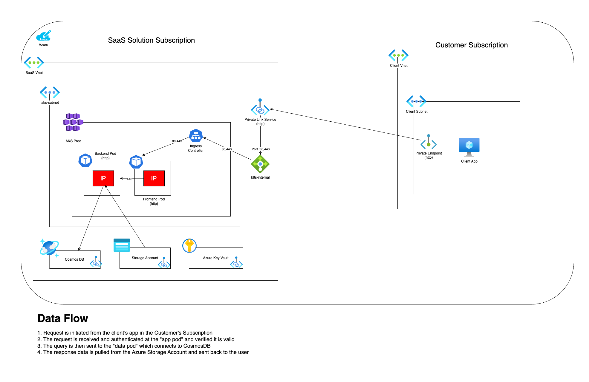

# Azure IP Co-sell Reference Architecture

A lot of Software Development Companies (SDC) are looking to achieve [Azure IP co-sell eligible status](https://learn.microsoft.com/en-us/partner-center/referrals/co-sell-overview), and for good reason. Co-sell status unlocks joint selling opportunities with Microsoft's field sales teams.

## Requirements

There are 4 [requirements](https://learn.microsoft.com/en-us/partner-center/referrals/co-sell-requirements#requirements-for-azure-ip-co-sell-eligible-status) to achieve Azure IP co-sell eligible status:

* Reach the required revenue threshold
* Pass Microsoft technical validation for an Azure-based solution (which includes a reference architecture diagram review)
* Provide a reference architecture diagram
* Offer is transactable on Microsoft Marketplace

For a SaaS solution to pass technical validation, it must be "primarily platformed on Azure." This is detailed in the [Marketplace Terms and Conditions for SaaS offers](https://learn.microsoft.com/en-us/legal/marketplace/certification-policies#1000-software-as-a-service-saas).

> **NOTE:** Before submitting, check out the [official reference architecture diagram documentation](https://learn.microsoft.com/en-us/partner-center/referrals/reference-architecture-diagram). It's worth reading to understand exactly what the review team is looking for.

Some important parts to that article are:
* Clealy show what's in the your Azure subscription and what's outside (e.g. use boxes to easily indicate).
* List each of the Azure Services your solution uses.
* Use red boxes with white bold text to showcase exactly where your Intellectual Properly (IP) resides
* Provide a detailed, numbered flow of the data with the user interfaces and other services

## Example Architecture

Many partners share similar architectural patterns, so this example is meant to give you a solid starting point. It's built with [Draw.io](https://draw.io/), which is free and easy to use.

This example models a SaaS architecture where a customer (also on Azure) connects to the SDC's API via Private Endpoint.

**Components included:**

* **SDC Subscription**
    * AKS
        * Ingress Controller
        * App pod (IP)
        * Data pod (IP)
    * Azure Load Balancer
    * CosmosDB
    * Storage Account
    * Azure Key Vault
* **Customer Subscription** (optional)

> **Note:** The red boxes represent the SDC's Intellectual Property (IP) and indicate where it runs within the architecture.

To use this as a starting point, [download the Draw.io source file](sample-reference-architecture.drawio) and modify it to reflect your own architecture.

