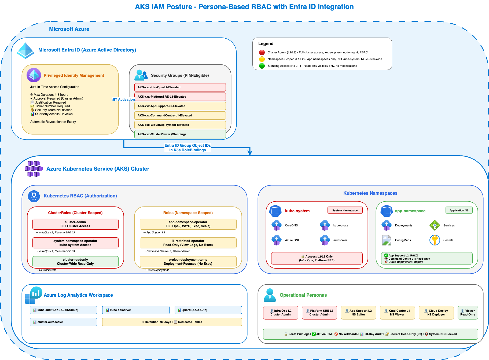

# AKS IAM Posture Implementation

This repository contains Infrastructure-as-Code and RBAC configurations for deploying AKS clusters with a comprehensive IAM posture aligned with enterprise security requirements.

## Overview

This implementation supports:

- **Nothing-Shared SaaS Model** - Isolated AKS clusters per customer/environment
- **Persona-Based Access** - Role-based access aligned with operational responsibilities  
- **Entra ID Integration** - All access via Entra ID groups (no individual assignments)
- **JIT Elevation via PIM** - Time-bound elevated access for privileged operations
- **Comprehensive Audit Logging** - All actions logged to Log Analytics

## Architecture



*Persona-based RBAC architecture with Entra ID integration, PIM-based JIT elevation, and comprehensive audit logging to Azure Log Analytics.*

## Directory Structure

```
├── infra/                          # Infrastructure-as-Code
│   ├── main.bicep                  # AKS cluster deployment (Bicep)
│   ├── main.bicepparam             # Bicep parameter file
│   └── terraform/                  # Terraform configuration
│       ├── main.tf                 # AKS cluster resources
│       ├── variables.tf            # Input variables
│       ├── outputs.tf              # Output values
│       ├── versions.tf             # Provider versions
│       └── terraform.tfvars        # Variable values
├── rbac/                           # Kubernetes RBAC manifests
│   ├── cluster/                    # Cluster-scoped roles & bindings
│   │   ├── cluster-roles.yaml
│   │   └── kustomization.yaml
│   └── namespace/                  # Namespace-scoped roles & bindings
│       ├── namespace-roles.yaml
│       ├── namespace-rolebindings.yaml
│       └── kustomization.yaml
├── scripts/                        # Deployment & validation scripts
│   ├── validate-rbac.sh           # Validate infrastructure & config
│   ├── validate-persona-permissions.sh  # Validate user permissions
│   ├── deploy-rbac-multi-cluster.sh
│   ├── setup-demo-accounts.sh
│   └── cleanup.sh                 # Remove all created resources
└── docs/                           # Documentation
    ├── README.md                   # Full implementation guide
    └── group-config-template.env   # Entra ID group configuration
```

## Quick Start

### 1. Deploy AKS Cluster

#### Option A: Bicep

```bash
# Copy example parameters and update with your values
cp infra/bicep/main.bicepparam.example infra/bicep/main.bicepparam
vi infra/bicep/main.bicepparam

# Update these values:
#   - clusterName
#   - location
#   - clusterAdminGroupObjectIds (Entra ID group object IDs)
#   - logAnalyticsWorkspaceResourceId (optional)
#   - tags

cd infra/bicep/

# Deploy
az deployment group create \
  --resource-group $RESOURCE_GROUP \
  --template-file main.bicep \
  --parameters main.bicepparam
```

#### Option B: Terraform

```bash
# Copy example parameters and update with your values
cp infra/terraform/terraform.tfvars.example infra/terraform/terraform.tfvars
vi infra/terraform/terraform.tfvars

# Update these values:
#   - cluster_name
#   - resource_group_name
#   - location
#   - cluster_admin_group_object_ids (Entra ID group object IDs)
#   - log_analytics_workspace_id (optional)

cd infra/terraform/

# Initialize and deploy
terraform init
terraform plan
terraform apply

# Get kubectl credentials
az aks get-credentials --resource-group $RESOURCE_GROUP --name $CLUSTER_NAME
```

### 2. Configure Entra ID Groups

Create groups following the naming convention in `docs/group-config-template.env`:

- `AKS-<ClusterName>-InfraOps-L2-Elevated`
- `AKS-<ClusterName>-AppSupport-L2-Elevated`
- `AKS-<ClusterName>-CommandCentre-L1-Elevated`
- etc.

### 3. Apply RBAC

```bash
# Update group object IDs in YAML files
# Then apply cluster-wide RBAC
kubectl apply -k rbac/cluster/

# Apply to each application namespace
kubectl apply -f rbac/namespace/namespace-roles.yaml -n <APP_NAMESPACE>
kubectl apply -f rbac/namespace/namespace-rolebindings.yaml -n <APP_NAMESPACE>
```

### 4. Create Demo Accounts

Create demo Entra ID users and groups for each persona using the setup script:

```bash
export TENANT=<YOUR TENANT>
./scripts/setup-demo-accounts.sh --domain $TENANT --cluster $CLUSTER_NAME
```

This creates:
- Entra ID groups (e.g., `AKS-<ClusterName>-InfraOps-L2-Elevated`)
- Demo users for each persona (e.g., `demo-infraops@yourtenant.onmicrosoft.com`)
- Group memberships mapping each user to their corresponding group

> **Note:** Requires Azure CLI logged in with Entra ID admin permissions (ability to create groups and users).

The script outputs a `.env` file (`demo-accounts-<CLUSTER_NAME>.env`) with the created user UPNs and group IDs, which is used by the validation script in the next step.

### 5. Validate

#### Validate Infrastructure and Configuration

```bash
./scripts/validate-rbac.sh $RESOURCE_GROUP $CLUSTER_NAME $LAW_NAME
```

This validates:
- Azure RBAC disabled (using Kubernetes RBAC)
- Local accounts disabled
- Custom RBAC roles deployed
- Cluster-admin not broadly assigned
- kube-system access restricted
- Diagnostic settings configured
- Audit logs flowing to Log Analytics

#### Validate Persona Permissions

```bash
# Run persona validation
./scripts/validate-persona-permissions.sh demo-accounts-<CLUSTER_NAME>.env
```

This validates each persona by impersonating users with `kubectl auth can-i` and testing:
- ✅ **Positive tests** - Expected permissions work (e.g., App Support can view logs and exec into pods)
- ❌ **Negative tests** - Restricted permissions are denied (e.g., cannot access kube-system)
- 🌐 **Scope tests** - Cluster-wide vs namespace-scoped access boundaries
- 🔒 **Privilege tests** - Read vs write capabilities for each role

**Tests performed per persona:**
- **Infra Ops L2 / Platform SRE L3**: Full cluster admin (5 tests each)
- **App Support L2**: Namespace editor with exec (8 tests)
- **Command Centre L1**: Namespace read-only (7 tests)
- **Cloud Deployment**: Deployment-only access (6 tests)
- **Viewer**: Cluster-wide read-only (6 tests)

All tests must pass to confirm proper least-privilege access controls.

## Personas & Permissions

| Persona | Scope | Key Permissions | JIT |
|---------|-------|-----------------|-----|
| Infra Ops (L2) | Cluster-wide | Full admin, kube-system access | ✅ |
| Platform SRE (L3) | Cluster-wide | Full admin, kube-system access | ✅ |
| App Support (L2) | App namespaces | Logs, exec, scale, restart | ✅ |
| Command Centre (L1) | App namespaces | Logs, restart (no exec) | ✅ |
| Cloud Deployment | App namespaces | Deploy + troubleshoot | ✅ |

## Documentation

See [docs/README.md](docs/README.md) for:

- Complete deployment guide
- Entra ID group naming conventions
- PIM configuration guidance
- Validation checklist
- Troubleshooting guide

## Cleanup

To remove everything created by this setup, run `scripts/cleanup.sh`:

```bash
# Remove only Entra ID users, groups, RBAC, and the generated .env file
./scripts/cleanup.sh --cluster <CLUSTER_NAME>

# Also destroy Terraform-managed infrastructure
./scripts/cleanup.sh --cluster <CLUSTER_NAME> --infra-tool terraform

# Also destroy Bicep-managed infrastructure (resource group delete)
./scripts/cleanup.sh --cluster <CLUSTER_NAME> --infra-tool bicep --resource-group <RESOURCE_GROUP>

# Also remove namespace-scoped RBAC from a specific namespace
./scripts/cleanup.sh --cluster <CLUSTER_NAME> --namespace <APP_NAMESPACE>

# Skip confirmation prompt
./scripts/cleanup.sh --cluster <CLUSTER_NAME> --yes
```

The script removes, in order:
1. Kubernetes ClusterRoles and ClusterRoleBindings (and namespace RBAC if `--namespace` is given)
2. Entra ID demo users (`demo-infraops`, `demo-platformsre`, etc.)
3. Entra ID groups (`AKS-<ClusterName>-*`)
4. AKS infrastructure (if `--infra-tool` is specified)
5. Generated `demo-accounts-<CLUSTER_NAME>.env` file

Use `--skip-rbac`, `--skip-users`, `--skip-groups`, `--skip-infra`, or `--skip-env-file` to omit individual steps.

## Security Features

- ✅ Azure RBAC for Kubernetes authorization
- ✅ Local accounts disabled (Entra ID enforced)
- ✅ Comprehensive audit logging
- ✅ Namespace isolation (app teams can't access kube-system)
- ✅ No wildcard permissions
- ✅ Group-based access only

## License

Internal use only.
